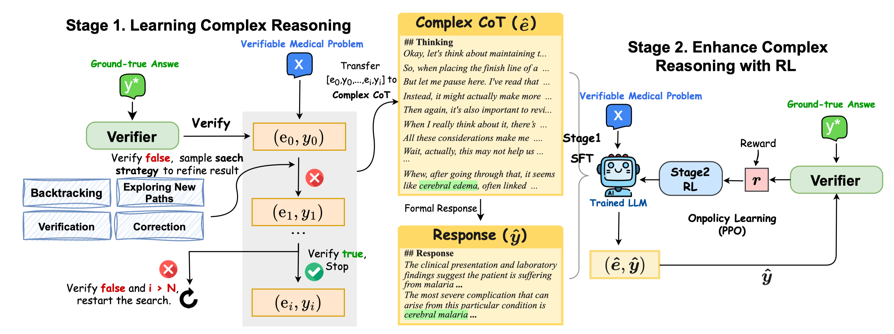

# HuatuoGPT-o1, Towards Medical Complex Reasoning with LLMs
<div align="center">
<h3>
  HuatuoGPT-o1
</h3>
</div>

<p align="center">
📃 <a href="https://arxiv.org/pdf/2412.18925" target="_blank">Paper</a> ｜🤗 <a href="https://huggingface.co/FreedomIntelligence/HuatuoGPT-o1-7B" target="_blank">HuatuoGPT-o1-7B</a> ｜🤗 <a href="https://huggingface.co/FreedomIntelligence/HuatuoGPT-o1-8B" target="_blank">HuatuoGPT-o1-8B</a> ｜ 🤗 <a href="https://huggingface.co/FreedomIntelligence/HuatuoGPT-o1-70B" target="_blank">HuatuoGPT-o1-70B</a>  | 📚 <a href="https://huggingface.co/datasets/FreedomIntelligence/medical-o1-reasoning-SFT" target="_blank">Data</a>
</p>


## ⚡ Introduction
Hello! Welcome to the repository for [HuatuoGPT-o1](https://arxiv.org/pdf/2412.18925)!

<div align=center>

</div>


**HuatuoGPT-o1** is a medical LLM designed for advanced medical reasoning. It can identify mistakes, explore alternative strategies, and refine its answers.  By leveraging verifiable medical problems and a specialized medical verifier, it advances reasoning through:

- Using the verifier to guide the search for a complex reasoning trajectory for fine-tuning LLMs.
- Applying reinforcement learning (PPO) with verifier-based rewards to enhance complex reasoning further.

We open-sourced our models, data, and code here.

## 👨‍⚕️ Model
- **Model Access**

|                      | Backbone     | Supported Languages | Link                                                                  |
| -------------------- | ------------ | ----- | --------------------------------------------------------------------- |
| **HuatuoGPT-o1-8B**  | LLaMA-3.1-8B  | English    | [HF Link](https://huggingface.co/FreedomIntelligence/HuatuoGPT-o1-8B) |
| **HuatuoGPT-o1-70B** | LLaMA-3.1-70B | English    | [HF Link](https://huggingface.co/FreedomIntelligence/HuatuoGPT-o1-70B) |
| **HuatuoGPT-o1-7B**  | Qwen2.5-7B   | English & Chinese | [HF Link](https://huggingface.co/FreedomIntelligence/HuatuoGPT-o1-7B) |
| **HuatuoGPT-o1-72B** | Qwen2.5-72B  | English & Chinese | [HF Link](https://huggingface.co/FreedomIntelligence/HuatuoGPT-o1-72B) |

- **Deploy**

HuatuoGPT-o1 can be used just like `Llama-3.1-8B-Instruct`. You can deploy it with tools like [vllm](https://github.com/vllm-project/vllm) or [Sglang](https://github.com/sgl-project/sglang),  or perform direct inference:
```python
from transformers import AutoModelForCausalLM, AutoTokenizer

model = AutoModelForCausalLM.from_pretrained("FreedomIntelligence/HuatuoGPT-o1-8B",torch_dtype="auto",device_map="auto")
tokenizer = AutoTokenizer.from_pretrained("FreedomIntelligence/HuatuoGPT-o1-8B")

input_text = "How to stop a cough?"
messages = [{"role": "user", "content": input_text}]

inputs = tokenizer(tokenizer.apply_chat_template(messages, tokenize=False,add_generation_prompt=True
), return_tensors="pt").to(model.device)
outputs = model.generate(**inputs, max_new_tokens=2048)
print(tokenizer.decode(outputs[0], skip_special_tokens=True))
```

HuatuoGPT-o1 adopts a *thinks-before-it-answers* approach, with outputs formatted as:

```
## Thinking
[Reasoning process]

## Final Response
[Output]
```

## 📚 Data
- **Data Access**

| Data                  | Description                                                                                   | Link                                                                                           |
| -------------------------- | ----------------------------------------------------------------- | --------------------------------------------------------------------------------------------- |
| Medical Verifiable Problems | Open-ended medical problems sourced from challenging medical exams,  paired with ground-truth answers. | [Link](https://huggingface.co/datasets/FreedomIntelligence/medical-o1-verifiable-problem)  |
| SFT Data in Stage 1        | Fine-tuning data generated using GPT-4o, including complex chains of thought (**Complex CoT**) and output (**Response**). | [Link](https://huggingface.co/datasets/FreedomIntelligence/medical-o1-reasoning-SFT)       |

- **Data Construction**

We provide scripts to construct verifiable problems and searching reasoning paths.

**1. Constructing Verifiable Problems from Multi-choice Questions.** 
```bash
python construct_verifiable_medical_problems.py --data_path  data/demo_data.json --filter_data --model_name gpt-4o --api_key [your api key]
```
**2. Searching Complex Reasoning Paths for SFT**

```bash
python search_for_complex_reasoning_path.py --data_path  data/demo_data.json --efficient_search True  --max_search_attempts 1 --max_search_depth 2 --model_name gpt-4o --api_key [your api key]
```


## 🚀 Training

- **Stage 1: Supervised Fine-Tuning (SFT)**

Fine-tune the model on an 8-GPU setup:
```bash
accelerate launch --config_file ./configs/deepspeed_zero3.yaml \
    --num_processes 8  \
    --num_machines 1 \
    --machine_rank 0 \
    --deepspeed_multinode_launcher standard SFT_stage1.py \
    --model_path [meta-llama/Llama-3.1-8B-Instruct] \
    --data_path [FreedomIntelligence/medical-o1-reasoning-SFT] 
```

- **Stage 2: Reinforcement Learning (RL)**

We provide a simple PPO script using the [trl](https://github.com/huggingface/trl) library. Below is an example for training an 8B model with PPO on an 8-GPU A100 machine. Ensure you first download our [medical verifier](https://huggingface.co/FreedomIntelligence/medical_o1_verifier_3B) as the reward model.

```bash
accelerate launch \
	--num_processes 8 \
	--num_machines 1 \
	--machine_rank 0 \
    --config_file ./configs/deepspeed_zero3.yaml \
	--deepspeed_multinode_launcher standard RL_stage2.py \
    --model_name_or_path [FreedomIntelligence/HuatuoGPT-o1-8B] \
    --reward_model_path [FreedomIntelligence/medical_o1_verifier_3B] \
    --value_model_path [meta-llama/Llama-3.2-3B-Instruct] \
    --dataset_name  [FreedomIntelligence/medical-o1-verifiable-problem]\
    --response_length 1300 \
    --temperature 0.5 \
    --local_rollout_forward_batch_size 8 \
    --num_ppo_epochs 3 \
    --num_mini_batches 1 \
    --total_episodes 20000 \
    --per_device_train_batch_size 1 \
    --gradient_accumulation_steps 16 \
    --bf16 True \
    --output_dir ./ckpts \
    --save_strategy steps \
    --save_step 20 \
    --save_total_limit 1 \
    --eval_strategy steps \
    --eval_steps 20 \
    --kl_coef 0.03 \
    --learning_rate 5e-7 \
    --warmup_ratio 0.05 \
    --gradient_checkpointing True \
    --dataloader_num_workers 4 \
    --run_name ppo_medical_o1_8B \
    --num_sample_generations -1 \
    --report_to wandb
```

## 🩺 HuatuoGPT Series 

Explore our HuatuoGPT series:
- [**HuatuoGPT**](https://github.com/FreedomIntelligence/HuatuoGPT): Taming Language Models to Be a Doctor
- [**HuatuoGPT-II**](https://github.com/FreedomIntelligence/HuatuoGPT-II): One-stage Training for Medical Adaptation of LLMs
- [**HuatuoGPT-Vision**](https://github.com/FreedomIntelligence/HuatuoGPT-Vision): Injecting Medical Visual Knowledge into Multimodal LLMs at Scale
- [**CoD (Chain-of-Diagnosis)**](https://github.com/FreedomIntelligence/Chain-of-Diagnosis): Towards an Interpretable Medical Agent using Chain of Diagnosis
- [**HuatuoGPT-o1**](https://github.com/FreedomIntelligence/HuatuoGPT-o1): Towards Medical Complex Reasoning with LLMs


## 📖 Citation
```
@misc{chen2024huatuogpto1medicalcomplexreasoning,
      title={HuatuoGPT-o1, Towards Medical Complex Reasoning with LLMs}, 
      author={Junying Chen and Zhenyang Cai and Ke Ji and Xidong Wang and Wanlong Liu and Rongsheng Wang and Jianye Hou and Benyou Wang},
      year={2024},
      eprint={2412.18925},
      archivePrefix={arXiv},
      primaryClass={cs.CL},
      url={https://arxiv.org/abs/2412.18925}, 
}
```


## Star History

[](https://star-history.com/#FreedomIntelligence/HuatuoGPT-o1&Date)
